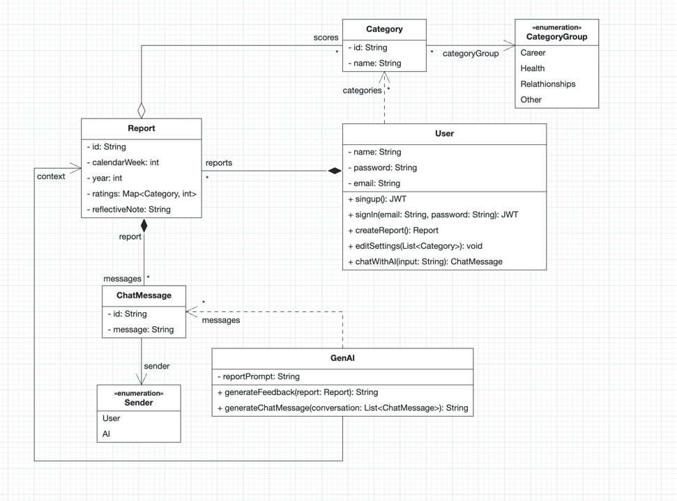

# Problem Statement

## 1. Main Functionality
The application’s main functionality is to enable users to:

- Evaluate important aspects of their life using the Wheel of Life
- Receive AI-generated suggestions and personalized feedback for improvement
- Track their evaluations over time and visualize trends
- Write reflective notes and input category ratings

AI will analyze both current and past data to provide actionable, mostly positive feedback and tailored suggestions.


---

## 2. Wheel of Life Categories

1. Career
2. Finances
3. Growth
4. Purpose
5. Health
    - Mental
    - Physical
6. Relationships
    - Family
    - Friends
    - Romance
7. Other
    - Spirituality
    - Personal Development
    - Entertainment
8. Custom Categories
    - Users can add (e.g., Social Engagement) or remove categories as they wish.

---

## 3. Intended Users

- Students
- Professionals
- Anyone aiming to improve and balance their life

---

## 4. GenAI Integration

- Analysis: AI processes weekly and historical ratings plus reflective notes.
- Feedback: Provides mostly positive, data-driven feedback.
- Suggestions: Offers small, actionable steps tailored to the user’s current state and trends.
- Privacy: Acts as a private coach, lowering the barrier to sharing personal reflections.

---

## 5. Example User Scenario

1. Login & Review:
    - User signs in via OAuth.
    - Views previous weeks’ Wheel of Life reports.

2. Weekly Report:
    - Rates satisfaction in each category.
    - Adds a short reflective note (e.g., "Feeling a bit lonely...")

3. AI-Generated Feedback:
    - Reflects the user’s notes and ratings.
    - Gives supportive commentary and action items.

4. Ongoing Reflection:
    - User interacts with AI assistant and reviews progress over time.

---

## Initial Product Backlog

- User Authentication
- Life Category Management
- Weekly Reflection Logging
- Personalized AI Feedback
- AI Assistant Interaction
- Progress Visualization

---

# Tech Stack

Frontend: Vite + React  
Backend: Spring Boot (Java)  
AI Service: Node.js + OpenAI API  
Auth: Spring Security + JWT  
Database: PostgreSQL  
Containerization: Docker & Docker Compose  
Monitoring: Prometheus + Grafana  
Reverse Proxy: Traefik (AWS deploy)

---

## Monitoring & Observability

Uses Prometheus (metrics) and Grafana (dashboards and alerting).

- Metrics: uptime, requests, errors, report counts.
- Dashboards: service-specific, CPU, trends.
- Alerts: Grafana rules for critical issues.

---

# CI/CD Workflows

- GitHub Actions-based
- Automated testing for each service
- Matrix build system builds 8 Docker images: 4 for EC2, 4 for Kubernetes
- Build and push images to GHCR
- Manual EC2 deployment
- Automatic Helm deployment to Rancher on `main` or `deployment` branches

> Note: EC2 and Rancher images differ by build args and tags. This distinction is currently handled via build arguments. For future development, a runtime configuration strategy (e.g., environment-based config injection or service discovery) will be adopted.


---

## Build Details

### Services:
- `authentication`
- `wheel-of-life`
- `client`
- `genai`

### Matrix Target:
- `ec2`
- `rancher`

Tags:
- `latest-ec2`, `latest-rancher`, branch names, PR refs

---

## AWS EC2 Deployment

- SCPs `compose-aws.yml` to EC2
- Generates `.env` file using GitHub secrets
- Runs Docker Compose

Domains (Traefik via `nip.io`):
- `client.<IP>.nip.io`
- `authentication.<IP>.nip.io`
- `wheel-of-life.<IP>.nip.io`
- `genai.<IP>.nip.io`

---

## Rancher Helm Deployment

- Runs on push to `main` or `deployment`
- Loads kubeconfig
- Installs Helm and deploys using Helm chart
- Uses `latest-rancher` image tag

---

## Secrets & Environment Variables

| Name              | Type     | Description                  |
|-------------------|----------|------------------------------|
| EC2_PUBLIC_IP     | Variable | EC2 IP for nip.io domains    |
| AWS_EC2_USER      | Variable | SSH user                     |
| AWS_EC2_PRIVATE_KEY | Secret | SSH key                      |
| POSTGRES_USER     | Variable | Database user                |
| POSTGRES_PASSWORD | Secret   | Database password            |
| GRAFANA_USER      | Variable | Grafana login                |
| GRAFANA_PASSWORD  | Secret   | Grafana password             |
| JWT_SECRET        | Secret   | JWT signing key              |
| OPENAI_API_KEY    | Secret   | GenAI service                |
| KUBE_CONFIG       | Secret   | kubeconfig for Rancher       |
| GITHUB_TOKEN      | Secret   | GHCR access                  |

---

## Workflow Diagram


---
---

# Diagrams


Use Case Diagram


Component Diagram


Analysis Object Model

---
## API Documentation (OpenAPI/Swagger)

You can explore and test the API endpoints for each service using OpenAPI documentation:

* **Authentication Service:** [http://localhost:8080/swagger-ui.html](http://localhost:8080/swagger-ui.html)
* **Wheel-of-Life Service:** [http://localhost:8081/swagger-ui.html](http://localhost:8081/swagger-ui.html)
* **GenAI Service:** [http://localhost:5001/apidocs](http://localhost:5001/apidocs)

---

## Getting Started (Local)

1. Clone the repository and create a .env file using .env.example as a reference.
2. Start the development environment:

bash
```bash
docker-compose up --build
```


3. Access the services:

* Frontend: [http://localhost:5173](http://localhost:5173)
* Wheel of Life Service: [http://localhost:8080](http://localhost:8080)
* Authentication Service: [http://localhost:8081](http://localhost:8081)
* GenAI Service: [http://localhost:5001](http://localhost:5001)

---

## Deployment (AWS with Traefik)

For production deployment, use:

```bash
docker-compose -f compose-aws.yml up -d
```

Make sure the following environment variables are configured:

* CLIENT_HOST
* AUTH_HOST
* GENAI_HOST
* GRAFANA_HOST
* JWT_SECRET
* OPENAI_API_KEY

---

## Environment Variables

Reference .env.example for required variables. Key ones include:

* POSTGRES_USER, POSTGRES_PASSWORD, POSTGRES_DB
* JWT_SECRET
* VITE_SERVER_URL, VITE_AUTH_URL, VITE_GENAI_URL
* OPENAI_API_KEY, OPENAI_MODEL
* GRAFANA_USER, GRAFANA_PASSWORD

---

## Project Structure

├── client/                  # Frontend (Vite + React)
├── server/
│   ├── wheel-of-life/       # Self-reflection microservice (Spring Boot)
│   └── authentication/      # Auth microservice (Spring Boot)
├── genai/                   # AI assistant backend
├── grafana/                 # Monitoring dashboards
├── prometheus/              # Prometheus config for scraping metrics
├── docker-compose.yml       # Local deployment
├── compose-aws.yml          # Production deployment (Traefik + HTTPS)
└── .env                     # Environment configuration


---

## License

Licensed under the MIT License.

---

## Authors

Developed by **Team OpsOnTheRocks** – TU Munich

---

## Contact

For questions, contributions, or suggestions — feel free to reach out or open an issue.
