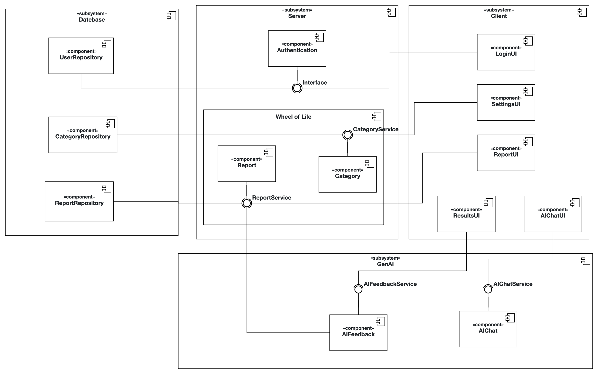

# Problem Statement

## 1. Main Functionality
The application’s main functionality is to enable users to:

- Evaluate important aspects of their life using the Wheel of Life
- Receive AI-generated suggestions and personalized feedback for improvement
- Track their evaluations over time and visualize trends
- Write reflective notes and input category ratings

AI will analyze both current and past data to provide actionable, mostly positive feedback and tailored suggestions.


---

## 2. Wheel of Life Categories

1. **Career**
2. **Finances**
3. **Growth**
4. **Purpose**
5. **Health**
    - Mental
    - Physical
6. **Relationships**
    - Family
    - Friends
    - Romance
7. **Other**
    - Spirituality
    - Personal Development
    - Entertainment
8. **Custom Categories**
    - Users can add (e.g., Social Engagement) or remove categories as they wish.

---

## 3. Intended Users
Individuals interested in personal development, emotional wellness, and self-reflection, including:

- Students
- Professionals
- Anyone aiming to improve and balance their life

---

## 4. GenAI Integration
- **Analysis**: AI processes weekly and historical ratings plus reflective notes.
- **Feedback**: Provides mostly positive, data-driven feedback.
- **Suggestions**: Offers small, actionable steps tailored to the user’s current state and trends.
- **Privacy**: Acts as a private coach, lowering the barrier to sharing personal reflections.

---

## 5. Example User Scenario

1. **Login & Review**
    - User signs in via OAuth.
    - Views previous weeks’ Wheel of Life reports.

2. **Weekly Report**
    - Rates satisfaction in each category.
    - Adds a short reflective note, e.g.:
      > “Feeling a bit lonely, haven’t seen my friends for two weeks and feel a little overworked.”

3. **AI-Generated Feedback**
   > “Based on your report, you’ve been feeling a bit lonely and mentioned feeling a little overworked.  
   > Similar to previous weeks, your finances are stable, which is a great foundation and something you can feel proud of — it shows you’ve been handling your responsibilities well.
   >
   > Here are a few small, positive steps you might try this week:
   > - 💬 Send a short message to a friend you haven’t talked to in a while, just to check in and see how they’re doing.
   > - 🤝 Try to meet up with a friend this weekend, or look for an interesting event or even visit a local park to meet new people.
   > - 🏃‍♂️ Add light exercise like a daily walk or some stretching — it’s great for boosting both mood and energy.
   > - 💤 Take short breaks during your workday to help recharge and ease the sense of being overworked.
   >
   > You’re already making progress, and these small steps can help things feel even better. Would you like more suggestions or have any other questions?”

4. **Ongoing Reflection**
    - User chats with the AI for further guidance.
    - Over time, reviews trend visualizations to see improvements.

---

## Initial Product Backlog

- **User Authentication**
   - As a user, I want to log in and log out of my account, so I can have access to stored data.

- **Life Category Management**
   - As a user, I want to add new and remove existing life categories, so my wheel of life reflects what truly matters in my life.

- **Weekly Reflection Logging**
   - As a user, I want to create weekly reflections by rating my life categories from 1-10 and adding a reflective note, so I can reflect and have visual evaluation of my week in a structured and visual way.

- **Personalized AI Feedback**
   - As a user, I want to receive improvement or encouragement as personalized AI feedback report, so I can have a more balanced fulfilling life.

- **AI Assistant Interaction**
   - As a user, I want to choose to interact with an AI assistant, so I can unleash the emotions that I am reluctant to share with other people and get helpful, empathic guidance.

- **Progress Visualization**
   - As a user, I want to view past weekly reports in visual charts, so I can track my emotional and personal progress over time.

---

# Tech Stack

| Layer             | Technology               |
|------------------|---------------------------|
| Frontend          | Vite + React              |
| Backend           | Spring Boot (Java)        |
| AI Service        | Node.js + OpenAI API      |
| Auth              | Spring Security + JWT     |
| Database          | PostgreSQL                |
| Containerization  | Docker & Docker Compose   |
| Monitoring        | Prometheus + Grafana      |
| Reverse Proxy     | Traefik (for AWS deploy)  |

---

## Authentication

- OAuth-based login (configurable)
- JWT for secure inter-service communication

---

## Monitoring & Observability

This project uses Prometheus for metrics collection and Grafana for visualization and alerting.

Prometheus is an open-source monitoring and alerting toolkit designed for reliability and scalability. In this project, Prometheus is used to collect metrics from all backend services (Authentication, Wheel of Life, GenAI) as well as from the infrastructure itself (CPU, memory, etc.).

**Prometheus**  
- Metrics collected include:
  - Service uptime
  - Request/response rates
  - Error counts
  - Number of reports created

Prometheus scrapes these metrics at regular intervals and stores them in a time-series database, making them available for querying and visualization.

**Grafana**  
Grafana visualizes these metrics through interactive dashboards. Dashboards include:
- System health overview
- Service-specific metrics (e.g., report creation trends)
- CPU usage

**Alerting:**
- Grafana supports alerting for critical events (e.g., service downtime, high error rates). Example alert rules and dashboards are provisioned automatically from the files in `grafana/provisioning/dashboards/` and `grafana/provisioning/datasources/`.

### Accessing Monitoring Tools

- **Local deployment:**
  - Grafana: [http://localhost:3000](http://localhost:3000) (default: admin/admin)
  - Prometheus: [http://localhost:9090](http://localhost:9090)

- **Kubernetes/AWS/Rancher deployment:**
  - Replace `localhost` with the cluster’s external IP or DNS name  
  - Example:
    - Grafana: `http://<your-aws-elb-dns>/grafana`
    - Prometheus: `http://<your-aws-elb-dns>/prometheus`

---

# CI/CD Workflows

To ensure reliability, test coverage, and streamlined deployment, this project uses **GitHub Actions** for continuous integration and delivery. It automates testing, Docker builds, AWS EC2 deployment, and Kubernetes Helm deployments to Rancher.

---

## Automated Testing

Tests are automatically run on every `push` for the following services:

| Service           | Technology Stack      | Test Framework      | Path                         |
|------------------|-----------------------|---------------------|------------------------------|
| GenAI             | Python 3.11           | pytest              | `genai/test_genai.py`        |
| Wheel of Life     | Spring Boot (Java 17) | Gradle (JUnit)      | `server/wheel-of-life/`      |
| Client (Frontend) | Node.js 20            | npm test            | `client/`                    |

---

## Docker Image Build & Push

All services are containerized using Docker and published to GitHub Container Registry (GHCR) on every commit. The workflow supports parallel builds using a matrix strategy:

| Service         | Context Path             |
|----------------|---------------------------|
| authentication | `server/authentication`   |
| wheel-of-life  | `server/wheel-of-life`    |
| client         | `client`                  |
| genai          | `genai`                   |

### Build Metadata

The following tags are generated using the `docker/metadata-action`:
- `latest` (for default branch)
- Branch name (e.g., `main`, `feature/...`)
- Pull request ref

### Frontend Build Arguments

For `client` and `genai`, `build-args` are passed to inject runtime URLs:

```

VITE\_SERVER\_URL
VITE\_AUTH\_URL
VITE\_GENAI\_URL
VITE\_SERVER\_URL\_RANCHER
VITE\_AUTH\_URL\_RANCHER
VITE\_GENAI\_URL\_RANCHER

````

---

## AWS EC2 Deployment

Manual deployment to EC2 is triggered using `workflow_dispatch`.

### Process Overview:
1. Copies `compose-aws.yml` to EC2 via SCP
2. Generates `.env` file on EC2 using GitHub secrets/variables
3. Runs Docker Compose to deploy all services

### Deployment Command:
```bash
docker compose -f compose-aws.yml up --pull always -d --remove-orphans
````

All services are served over HTTPS using Traefik and `nip.io` subdomains like:

* `client.<IP>.nip.io`
* `authentication.<IP>.nip.io`
* `wheel-of-life.<IP>.nip.io`
* `genai.<IP>.nip.io`

---

## Rancher Helm Deployment

Automatic deployment to the Kubernetes cluster (via Rancher) happens on push to the `main` or `deployment` branches.

### Helm Deployment Steps:

1. Load kubeconfig from GitHub Secrets
2. Install Helm and kubectl
3. Ensure the `opsontherocks` namespace exists
4. Deploy with Helm using commit SHA as image tag

### Command:

```bash
helm upgrade --install wheeloflife ./deployment/helm \
  --namespace opsontherocks \
  --set image.tag=<commit-sha> \
  --wait
```

---

## Secrets & Environment Configuration

The workflows rely on the following GitHub Secrets and Variables:

| Name                  | Type     | Description                        |
| --------------------- | -------- | ---------------------------------- |
| `EC2_PUBLIC_IP`       | Variable | EC2 public IP used for nip.io URLs |
| `AWS_EC2_USER`        | Variable | SSH username for EC2               |
| `AWS_EC2_PRIVATE_KEY` | Secret   | SSH private key for EC2 access     |
| `POSTGRES_USER`       | Variable | Database username                  |
| `POSTGRES_PASSWORD`   | Secret   | Database password                  |
| `GRAFANA_USER`        | Variable | Grafana login user                 |
| `GRAFANA_PASSWORD`    | Secret   | Grafana login password             |
| `JWT_SECRET`          | Secret   | Used for JWT signing in auth       |
| `OPENAI_API_KEY`      | Secret   | Used by GenAI service              |
| `KUBE_CONFIG`         | Secret   | kubeconfig for Rancher access      |
| `GITHUB_TOKEN`        | Secret   | Used to authenticate with GHCR     |

---

## CI/CD Workflow Summary


---

# Diagrams


Use Case Diagram


Component Diagram


Analysis Object Model

---

## API Documentation (OpenAPI/Swagger)

You can explore and test the API endpoints for each service using OpenAPI documentation:

* **Authentication Service:** [http://localhost:8080/swagger-ui.html](http://localhost:8080/swagger-ui.html)
* **Wheel-of-Life Service:** [http://localhost:8081/swagger-ui.html](http://localhost:8081/swagger-ui.html)
* **GenAI Service:** [http://localhost:5001/apidocs](http://localhost:5001/apidocs)

---

## Getting Started (Local)

1. Clone the repository and create a `.env` file using `.env.example` as a reference.
2. Start the development environment:

```bash
docker-compose up --build
```

3. Access the services:

* Frontend: [http://localhost:5173](http://localhost:5173)
* Wheel of Life Service: [http://localhost:8080](http://localhost:8080)
* Authentication Service: [http://localhost:8081](http://localhost:8081)
* GenAI Service: [http://localhost:5001](http://localhost:5001)

---

## Deployment (AWS with Traefik)

For production deployment, use:

```bash
docker-compose -f compose-aws.yml up -d
```

Make sure the following environment variables are configured:

* `CLIENT_HOST`
* `AUTH_HOST`
* `GENAI_HOST`
* `GRAFANA_HOST`
* `JWT_SECRET`
* `OPENAI_API_KEY`

---

## Environment Variables

Reference `.env.example` for required variables. Key ones include:

* `POSTGRES_USER`, `POSTGRES_PASSWORD`, `POSTGRES_DB`
* `JWT_SECRET`
* `VITE_SERVER_URL`, `VITE_AUTH_URL`, `VITE_GENAI_URL`
* `OPENAI_API_KEY`, `OPENAI_MODEL`
* `GRAFANA_USER`, `GRAFANA_PASSWORD`

---

## Project Structure

```
├── client/                  # Frontend (Vite + React)
├── server/
│   ├── wheel-of-life/       # Self-reflection microservice (Spring Boot)
│   └── authentication/      # Auth microservice (Spring Boot)
├── genai/                   # AI assistant backend 
├── grafana/                 # Monitoring dashboards
├── prometheus/              # Prometheus config for scraping metrics
├── docker-compose.yml       # Local deployment
├── compose-aws.yml          # Production deployment (Traefik + HTTPS)
└── .env                     # Environment configuration
```

---

## License

Licensed under the MIT License.

---

## Authors

Developed by **Team OpsOnTheRocks** – TU Munich

---

## Contact

For questions, contributions, or suggestions — feel free to reach out or open an issue.
